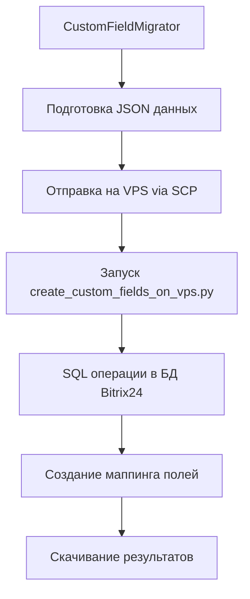
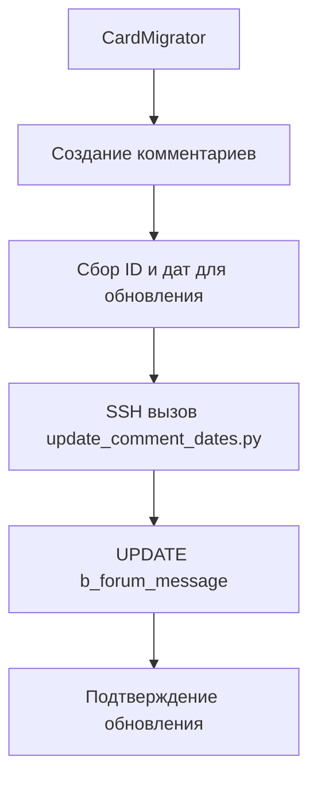
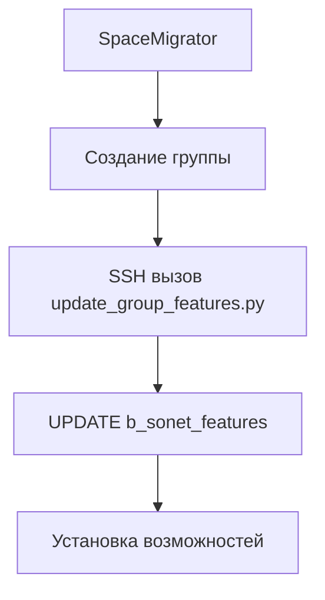

# VPS Скрипты Kaiten-to-Bitrix

## 📋 Описание

Каталог содержит специализированные скрипты для выполнения операций, которые невозможно реализовать через стандартное API Bitrix24. Эти скрипты запускаются на VPS сервере с прямым доступом к базе данных Bitrix24 и решают критические ограничения платформы при миграции данных из Kaiten.

## 🚫 Проблемы API Bitrix24

### Ограничения, требующие VPS решений:

1. **Создание пользовательских полей**
   - API Bitrix24 не предоставляет методы для программного создания пользовательских полей задач
   - Невозможно создать поля типа `enumeration` с предустановленными значениями
   - Нет возможности настроить все параметры поля (сортировка, отображение, языковые версии)

2. **Обновление дат комментариев**
   - API не позволяет изменять дату создания комментариев после их создания
   - Поле `POST_DATE` в таблице `b_forum_message` недоступно для модификации через REST API
   - Критично для сохранения хронологии при миграции исторических данных

3. **Настройка возможностей рабочих групп**
   - Ограниченный API для управления возможностями групп (задачи, файлы, календарь и т.д.)
   - Сложности с массовым обновлением настроек для множества групп

## 📁 Структура каталога

```
scripts/vps/
├── create_custom_fields_on_vps.py    # Создание пользовательских полей через SQL
├── update_comment_dates.py           # Обновление дат комментариев
├── update_group_features.py          # Управление возможностями рабочих групп
├── deploy_vps_scripts.ps1           # Развертывание скриптов на VPS
└── README.md                        # Данная документация
```

## 🔧 Описание скриптов

### create_custom_fields_on_vps.py

**Назначение:** Создание пользовательских полей для задач Bitrix24 через прямой SQL доступ.

**Использование в проекте:**
- Вызывается из `migrators/custom_field_migrator.py`
- Получает JSON данные с полями Kaiten
- Создает соответствующие поля в Bitrix24
- Генерирует маппинг ID полей и значений

**Ключевые операции:**
- Вставка записей в таблицы `b_user_field`, `b_user_field_enum`, `b_user_field_lang`
- Создание столбцов в таблице `b_uts_tasks_task`
- Генерация транслитерированных имен полей
- Создание многоязычных версий полей

**Зависимости:**
```python
# config/settings.py
ssh_host: str = ""
ssh_user: str = "root" 
ssh_key_path: str = ""

# migrators/custom_field_migrator.py
self.vps_script_path = "/root/kaiten-vps-scripts/create_custom_fields_on_vps.py"
```

### update_comment_dates.py

**Назначение:** Обновление дат создания комментариев для сохранения исторической хронологии.

**Использование в проекте:**
- Вызывается из `migrators/card_migrator.py` в методе `update_comment_dates_via_ssh()`
- Принимает JSON с маппингом {comment_id: datetime}
- Обновляет поле `POST_DATE` в таблице `b_forum_message`

**Пример вызова:**
```python
comment_dates = {"601": "2025-07-08 14:22:00", "602": "2025-07-08 15:30:00"}
ssh_success = self.update_comment_dates_via_ssh(comment_dates)
```

**Зависимости:**
```python
# config/settings.py
vps_script_path: str = "/root/kaiten-vps-scripts/update_comment_dates.py"
```

### update_group_features.py

**Назначение:** Настройка возможностей рабочих групп (задачи, файлы, календарь, чат и т.д.).

**Использование в проекте:**
- Вызывается из `migrators/space_migrator.py` в методе `set_group_features_via_ssh()`
- Устанавливает стандартный набор возможностей для новых групп
- Поддерживает массовое обновление всех групп

**Стандартные возможности:**
- `tasks` - Задачи
- `files` - Диск  
- `calendar` - Календарь
- `chat` - Чат
- `landing_knowledge` - База знаний
- `search` - Поиск

**Зависимости:**
```python
# migrators/space_migrator.py  
remote_script = "/root/kaiten-vps-scripts/update_group_features.py"
```

### deploy_vps_scripts.ps1

**Назначение:** Автоматическое развертывание всех VPS скриптов на сервер.

**Функции:**
- Чтение SSH настроек из `env.txt` или `.env`
- Создание каталога `/root/kaiten-vps-scripts/` на VPS
- Копирование всех Python скриптов через SCP
- Установка правильных разрешений для исполнения

**Требуемые переменные окружения:**
```bash
SSH_HOST=your-vps-server.com
SSH_USER=root
SSH_KEY_PATH=C:/path/to/private-key.ppk
```

## 🔄 Процесс работы

### 1. Создание пользовательских полей



### 2. Обновление дат комментариев



### 3. Настройка групп



## 📊 Альтернативные решения

### Исследование других подходов:

1. **Сторонние модули:**
   - [Intervolga CRM Field-level permissions](https://intervolgaru.com/blog/crm-field-level-permissions/) - модуль для управления пользовательскими полями
   - Ограничение: только для Bitrix24 On-Premise

2. **REST API + Webhooks:**
   - Частичное решение через комбинацию API методов
   - Ограничение: не покрывает все необходимые операции

3. **Marketplace приложения:**
   - Сторонние приложения из Bitrix24 Market
   - Ограничение: не решают задачи миграции данных

4. **Bitrix Framework:**
   - Использование D7 компонентов для On-Premise версий
   - Ограничение: требует доступа к файловой системе сервера

### Выбранное решение: SQL + VPS

**Преимущества:**
- ✅ Полный контроль над операциями
- ✅ Возможность выполнения любых SQL операций
- ✅ Сохранение целостности данных
- ✅ Высокая производительность
- ✅ Работает с облачной версией Bitrix24

**Недостатки:**
- ⚠️ Требует прямого доступа к БД
- ⚠️ Обход официального API
- ⚠️ Необходимость VPS сервера
- ⚠️ Зависимость от структуры БД Bitrix24

## 🛠️ Развертывание

### 1. Подготовка VPS сервера

```bash
# Установка зависимостей
pip3 install pymysql
```

Настройка доступа к MySQL: Используется существующий файл `/root/.my.cnf` на VPS-сервере Bitrix24


### 2. Развертывание скриптов

```powershell
# Запуск из корня проекта
.\scripts\vps\deploy_vps_scripts.ps1
```

### 3. Проверка развертывания

```bash
# На VPS сервере
ls -la /root/kaiten-vps-scripts/
python3 /root/kaiten-vps-scripts/update_group_features.py --help
```

## 🔒 Безопасность

### Меры предосторожности:

1. **SSH ключи:**
   - Используйте только ключи, не пароли
   - Ограничьте доступ по IP адресам

2. **Права доступа:**
   - Минимально необходимые права для пользователя БД
   - Изоляция скриптов в отдельном каталоге

3. **Мониторинг:**
   - Логирование всех операций
   - Флаговые файлы для отслеживания статуса

4. **Бэкапы:**
   - Обязательное резервное копирование БД перед операциями
   - Тестирование на копии данных

## 📝 Логирование

Все скрипты ведут подробное логирование:

- **create_custom_fields_on_vps.py:** Флаговые файлы для мониторинга процесса
- **update_comment_dates.py:** Консольный вывод результатов операций  
- **update_group_features.py:** Детальная информация о обновленных группах

## 🔍 Отладка

### Частые проблемы:

1. **Ошибки SSH соединения:**
   ```bash
   # Проверка доступности сервера
   ssh -i /path/to/key user@server "echo 'Connection OK'"
   ```

2. **Ошибки доступа к БД:**
   ```bash
   # Проверка настроек MySQL
   mysql --defaults-file=/root/.my.cnf -e "SELECT 1"
   ```

3. **Проблемы с правами файлов:**
   ```bash
   # Исправление прав доступа
   chmod 755 /root/kaiten-vps-scripts/*.py
   ```

## 📈 Производительность

### Оптимизации:

- **Батчевая обработка:** Скрипты обрабатывают данные пакетами
- **Кеширование:** Минимизация повторных SQL запросов  
- **Транзакции:** Использование транзакций для целостности данных
- **Индексы:** Использование существующих индексов БД

### Метрики:

- Создание пользовательских полей: ~10-15 полей/минута
- Обновление дат комментариев: ~100-200 записей/секунда
- Настройка возможностей групп: ~5-10 групп/секунда

---

**Внимание:** Данные скрипты предназначены для использования только во время миграции данных. После завершения миграции рекомендуется отключить прямой доступ к базе данных и использовать стандартные методы API Bitrix24. 